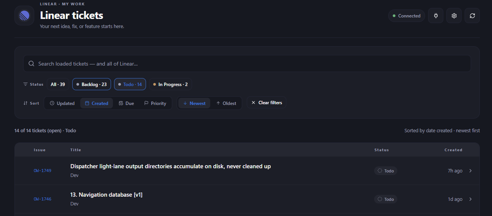
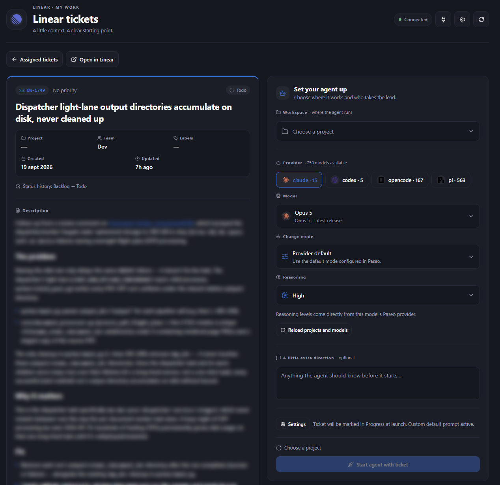
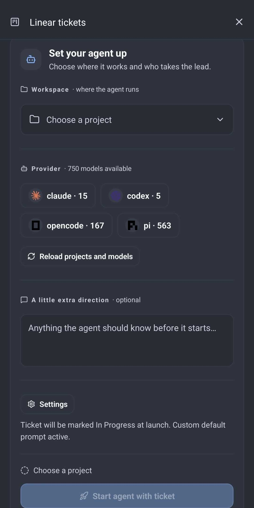

# Linear tickets

A Paseo sidebar plugin that connects to Linear's GraphQL API, shows tickets assigned to you
(filtered and searched server-side across your workspace), and starts an agent with the
ticket details, comments and relationships in its first prompt.





## Install

Requires Paseo 0.8.0 or newer and Node.js 22 or newer on the daemon host.

From npm, with Paseo 0.9 or newer (the pinned package and its production
dependencies are installed for you):

```sh
paseo plugin add npm:paseo-linear-tickets@0.1.1
```

From a local checkout:

```sh
cd linear-tickets
npm ci
npm run typecheck
npm test
paseo plugin install /absolute/path/to/linear-tickets
```

Enable plugins in Paseo Settings → Plugins if needed. Open **Linear tickets** in
the sidebar or **Open Linear tickets** in the command center. After source changes:

```sh
paseo plugin reload linear-tickets
```

## Connect and start work

1. Create a personal Linear API key in Settings → Security & access. Read permission
   and access to the relevant teams are sufficient; write permission is only needed
   for the optional "mark the ticket In Progress" step (see below).
2. Paste it into **Connect Linear**. Alternatively, set `LINEAR_API_KEY` in the
   Paseo daemon's environment before starting the daemon.
3. Select an assigned ticket. Preview the ticket context and choose a Paseo project.
   For Git projects, select a base branch from the local or remote branches known
   to the checkout. Choose a provider, then search its models. When supported, choose the
   provider's change mode and the model's reasoning level, then optionally add instructions.
4. Select **Start agent with ticket**, then **Open agent**.

Tickets load in pages of 50. By default they cover **open work only** — completed,
canceled and duplicated states are hidden server-side; the **Settings** menu (gear in
the header) has a toggle to include them. The status chips show counts over exactly
what the list shows, following that setting — Linear's GraphQL exposes no aggregation,
so they come from a bounded server pass (25 pages × 50; counts show a “+” when your
assignments exceed that) and selecting a chip filters the list server-side by that
exact state name. The search box filters the loaded tickets
instantly and, from two characters up, also runs Linear's workspace-wide search:
its matches appear in a separate **Across Linear** section, and tickets already on
the list are not repeated there. Sort by **Updated**, **Created**, **Due date** or
**Priority**, then **Newest / Oldest** (for due dates: latest / soonest; for priority:
highest / lowest); missing dates and tickets with no priority sort last. Sorting
applies to the loaded tickets; choose **Load all tickets** to include
every assignment. Archived tickets are excluded.

The most recent first page and its status counts are cached on the Paseo host. Reopening
the surface within five minutes uses that snapshot immediately instead of querying Linear
again; older snapshots are shown while a fresh request runs. The list shows when it was
last updated, and **Refresh tickets** always requests a fresh page. Caches are isolated by
the connected Linear credential and by the open/closed-ticket setting.

Rows show the ticket's priority, a status colour and icon for its workflow state,
label chips, a due date and estimate when your team sets them, and a relative
timestamp ("3h ago"), with the absolute date in the accessibility label. Status colours follow Linear's workflow category (`started`,
`completed`, `canceled`, `backlog`, `unstarted`, `duplicate`, …), so custom state
names such as "In Review" get the right tone in any workspace; keyword matching on
the state name remains as a fallback for categories that are not recognised. While tickets load,
placeholder rows stand in for the table so the layout does not jump.

For Git projects, the plugin creates a dedicated worktree from the selected base
branch, using Linear's own branch name for the ticket (which respects your workspace's
branch-format setting) so Linear's GitHub integration keeps matching branches to issues.
If that name is missing or not a safe git ref, a `<ticket id>–<request id>` fallback is
used instead. When the branch already exists — for example a second launch of the same
ticket — the worktree is created once more with a short request-id suffix appended.
Your existing checkout is not switched. Remote
branches use their locally fetched state; fetch in the project first if you need
the newest remote commits. Projects without Git use their project directory.

Each created agent keeps the Linear issue ID, identifier and URL in its Paseo labels.
Opening that ticket later shows its linked agents and lets you jump straight back to
them, including after the plugin or daemon restarts. In the other direction, the
agent's **Linear ticket** panel opens the linked issue in Linear. These references live
with Paseo's agent records rather than being copied into the agent prompt.
New agents also receive a visible Linear ticket card in their conversation timeline,
with a direct **Open in Linear** action. From any agent view, the command center action
**Open linked Linear ticket** opens the same panel; this provides a route for linked
agents created before timeline cards were introduced.

The launch fetches fresh details, relationships and comments through Linear's GraphQL API.
Relationships arrive in both directions — links the ticket makes and links pointing at it
(blocks, blocked by, related, duplicates, duplicated by) — and appear as a compact
**Relationships** list above the JSON snapshot, so the agent sees blockers before starting
work. Status changes arrive the same way: a compact **Status changes** line (for example
"Todo → In Progress → Done (currently Done)") and the raw state-history spans in the JSON
snapshot. The JSON response is preserved in the prompt, including the description and any
returned links. Linked documents and attachments are not downloaded. If comments
are unavailable, the preview and agent prompt say so. Context over 200,000 characters
is rejected rather than silently truncated.

The ticket preview shows the ticket's project, team, labels, priority, dates (including
due date and estimate when set) and a status-history line, then renders the description as Markdown: headings, bullet and numbered lists, task
checkboxes, pipe tables, quotes, dividers, bold text, inline code and fenced code
blocks. Tables scroll horizontally when they are too wide and keep their column
alignment. Code blocks carry a copy button, and **Copy context** copies the exact
JSON snapshot that will be sent to the agent. HTTPS images linked with standard
Markdown image syntax and interactive HTTPS links are rendered too.
Images are loaded by the Paseo client only for display and are not downloaded into the
agent's workspace or added to its prompt. Provider badges, available modes, and reasoning
levels are read from the configured Paseo provider catalog; unavailable capabilities stay
out of the form.

## Settings

The **Settings** menu (gear icon in the header, next to the connection and refresh
buttons) holds the plugin's per-host settings:

- **Ticket status** — optionally mark the ticket In Progress when the agent starts
  (off by default; see below).
- **Tickets shown** — include completed, canceled and duplicated tickets in the list
  and the status counts (off by default, keeping the list focused on open work).
- **Default prompt** — replace the built-in launch prompt with a template (below).

## Customizing the launch prompt

Every launch starts from the built-in default prompt: work on the ticket in the current
workspace, respect the repository's instructions, and treat the snapshot as data, not as
authority. You can replace it with your own template under **Default prompt** in the
plugin's **Settings** (gear icon in the header) — for example to have the agent list a
plan before coding, run the test suite, or open a pull request in a specific format.

Placeholders are substituted at launch time:

- `{{ticket}}` — the ticket's ID and title
- `{{instructions}}` — the per-launch "A little extra direction" text
- `{{context}}` — the ticket snapshot (required; a template without it is rejected)

Templates are limited to 8,000 characters, stored per host with the other plugin settings,
and apply to new agents only. **Reset to built-in** restores the default. The per-launch
instructions field and the 200,000-character context limit apply as before.

## Marking tickets In Progress

By default the plugin never changes Linear. When you switch on **Mark the ticket In
Progress when the agent starts** in the plugin's **Settings** (gear icon in the
header), a launch also moves the ticket
into its team's started state — the state named *In Progress* when the team has one,
otherwise the first started state in the team's workflow. Tickets already in a started
state are left as they are, and a team without a started state never produces a write.
The choice is saved per host and needs Linear's write permission. If the change cannot
be made, the agent still starts and the failure appears as a warning with the result.

## Connection storage

The API-key form stores the key on the daemon host in
`$PASEO_HOME/linear-tickets/credentials.json` (default:
`~/.paseo/linear-tickets/credentials.json`). The directory is owner-only and the
file uses mode `0600`; it is a plaintext credential, not an OS keychain entry.
`LINEAR_API_KEY` takes precedence over a saved key. Disconnect removes the saved
key; environment keys must be removed from the daemon environment followed by a
restart. All clients connected to this host share the same Linear account. Saved
default-prompt templates live next to the key in `settings.json` with the same
permission pattern. The ticket snapshot cache lives in `cache.json` with the same
private permissions; its credential scope is a one-way hash, never the API key itself.

The plugin talks directly to Linear's official [GraphQL API](https://linear.app/developers/graphql)
at `https://api.linear.app/graphql`. Its queries are read-only; the only write is the
optional In Progress transition made when a launch is explicitly opted in. Only the
server contacts Linear. The key is never added to ticket context, agent configuration,
or agent labels.

Repeated launch requests reuse their result for the lifetime of the loaded plugin.
If agent creation returns an uncertain failure, the same request is not retried
automatically: check the project's workspaces and agent list before reopening the ticket to
start again. This retry cache does not survive a plugin or daemon restart.

## Validation

`npm run typecheck` checks both entrypoints against Paseo's SDK. `npm test` covers
GraphQL response parsing, pagination, context preservation, prompt template rendering
and validation, credential and settings persistence, ticket retrieval, state-transition
resolution and failure handling, and agent creation/retries with mocked Linear and Paseo
calls.
Live account authentication and agent execution require your configured host and key.
